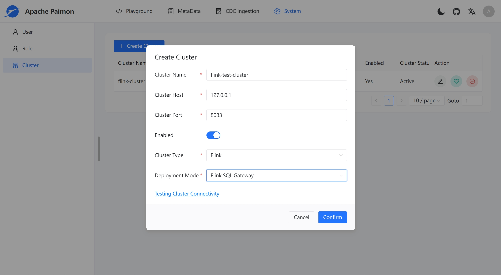

# Quick Start

This brief tutorial will guide you through the steps to deploy and utilize Paimon Web effectively.

## Prerequisite

- Install Java 8 runtime environment.
- Apache Flink 1.17+
- Apache Paimon 0.8.1+

## Download binary package

Download the Paimon Web installation package from paimon.apache.org and proceed with the following steps.

```shell
# Download the binary installation package of Paimon Web
[root@paimon ~]# wget https://repository.apache.org/snapshots/org/apache/paimon/paimon-web/0.1-SNAPSHOT/apache-paimon-webui-0.1-SNAPSHOT-bin.tar.gz

# Extract the installation package
[root@paimon ~]# tar zxf apache-paimon-webui-0.1-SNAPSHOT-bin.tar.gz
    
# Rename the directory to paimon-webui for simplicity
[root@paimon ~]# mv apache-paimon-webui-0.1-SNAPSHOT-bin.tar.gz paimon-webui
```
The directory structure following the decompression is as follows:
```shell
bin
config
libs
scripts
ui
```

## Download additional dependencies(Optional)

The released installation package of Paimon Web does not include some additional dependencies, such as `S3` and `OSS`. When using these dependencies to create a Catalog or as the default storage for your Paimon tables, download them from the [Apache Maven Repository](https://repo.maven.apache.org/maven2/org/apache/paimon/) and move them to the `$PAIMON_WEBUI_HOME/libs` directory.

```shell
[root@paimon ~]# wget https://repo.maven.apache.org/maven2/org/apache/paimon/paimon-oss/xxx/paimon-oss-xxx.jar
[root@paimon ~]# wget https://repo.maven.apache.org/maven2/org/apache/paimon/paimon-s3/xxx/paimon-s3-xxx.jar
[root@paimon ~]# mv paimon-oss-xxx.jar paimon-s3-xxx.jar $PAIMON_WEBUI_HOME/libs
```

## Creating a Database and Executing SQL Scripts

To set up your environment, create a database named `paimon`. Then, execute the `paimon-mysql.sql` script located in the `scripts` directory.

## Configuration File Adjustments

To tailor Paimon Web to your environment, you may need to modify certain settings:

1. **Update General Settings**: Edit the `application.yml` file in the `config` directory to adjust the port and other configuration details as necessary.
2. **Set Up Database Connection**: Configure the database connection by editing the `application-prod.yml` file, also located in the `config` directory.

These changes will ensure that Paimon Web runs smoothly with your specific setup.

## Environment Configuration

To configure the environment for your application, follow these steps:

1. **Set Environment Variables**: Modify the `env.sh` script located in the `bin` directory. You can configure variables such as `FLINK_HOME`, `ACTION_JAR_PATH`, and `JAVA_HOME`.
2. **Optional Settings**: If you are not using the CDC (Change Data Capture) function, there is no need to configure `FLINK_HOME` and `ACTION_JAR_PATH`.

This setup will prepare your system to properly run the application with the necessary configurations.

```shell
[root@paimon ~]# cd bin
[root@paimon ~]# chmod 755 env.sh
[root@paimon ~]# vi env.sh
```

## Starting the Service

To launch the service, follow these steps:

1. **Execute the Start Script**: Run the start script from your terminal:
```shell
[root@paimon ~]# bin/start.sh
```
2. **Access the Web Interface**: Open a web browser and enter the URL `http://{ip}:{port}/ui/login` to navigate to the Paimon web page.

Ensure you replace `{ip}` and `{port}` with the actual ip address and port number where the service is running.

## Execute a Flink SQL

To execute a Flink SQL, follow these comprehensive steps:

### 1. Start Flink SQL Gateway

Begin by initiating the Flink SQL Gateway to enable SQL operations on your Flink cluster. This is the first step to setting up your environment for SQL execution. Run the following command on your server to start the gateway:

```shell
[root@paimon ~]#  ./bin/sql-gateway.sh start -Dsql-gateway.endpoint.rest.address=localhost
```

### 2. Create a Cluster Instance

After the SQL Gateway is up and running, proceed to create a cluster instance through the Paimon web interface. This step is crucial for managing and deploying your SQL tasks effectively. Follow these steps in the web interface:

- Navigate to the cluster management section.
- Click on the 'Add' button to start the creation process.



### 3. Execute a Flink SQL Command

With the cluster ready, you can now execute SQL commands. Go to the SQL IDE page on the Paimon web interface, where you can write and execute your SQL queries.


